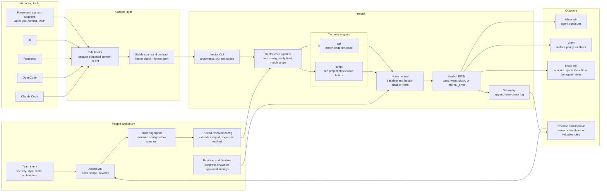

# Architecture diagram

Hector turns repo-local policy into an automatic gate for AI coding agents. The short version: adapters catch edits, the `hector` binary checks those edits against trusted rules, and the adapter turns the verdict back into "keep going" or "fix this first."

## What this shows

- **Policy lives with the code.** The `.hector.yml` travels with the repo, so every agent sees the same rules and severities.
- **Adapters are thin.** Claude Code, OpenCode, Reasonix, pi, and future adapters capture host events and consume Hector's verdict. Policy logic stays in `hector-core`.
- **Two engines, one gate.** Shell checks cover anything a command can decide; AST matching catches code structure a regex would miss. Both are deterministic and run locally.
- **Trust comes before power.** Script rules can execute commands, so Hector verifies the signed config before any rule runs.
- **The verdict is machine-readable.** `pass`, `warn`, `block`, and `internal_error` map to stable exit codes that agents and CI can act on automatically. Per-edit gates block immediately so the agent retries before the change lands.
- **The system improves over time.** Baselines and disables keep adoption practical; telemetry shows which rules are noisy, valuable, or dead.

## Mental model

Hector is not another linter. It is the policy layer around AI-generated edits: local enough to understand a repository's rules, and structured enough to turn them into deterministic gates an agent must clear before its edit lands.
